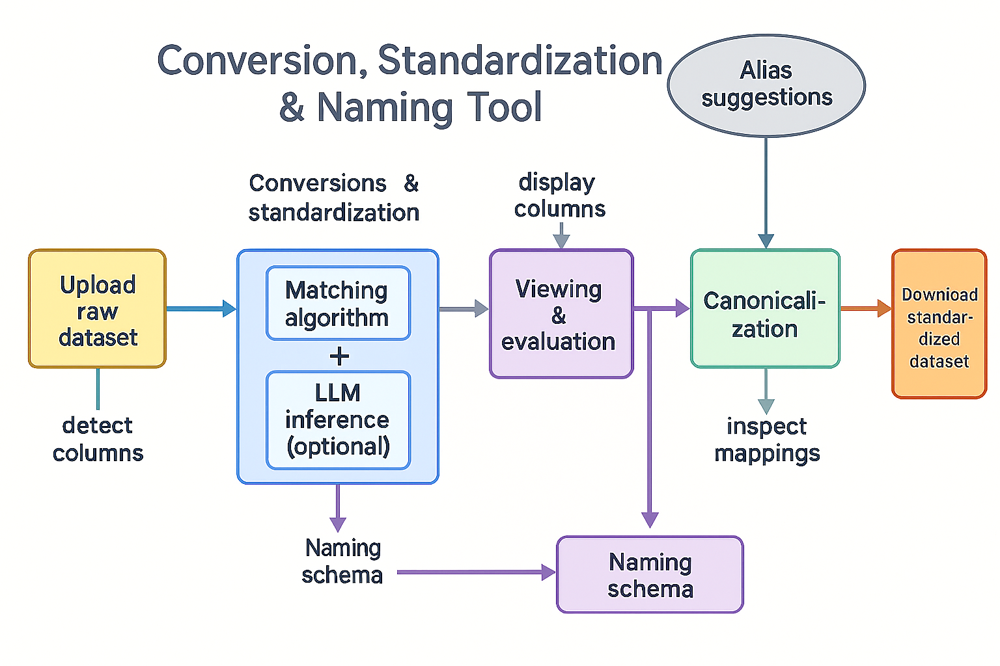

### OpenDV-HCI: A Toolkit for Reproducible Mapping and Reporting of Dependent Variables
**Standardizing Outcome Measures in Empirical HCI Research Through Schema-Driven Conversion and Open Data Harmonization**

* **Postgraduate Contributor:** Meriem Mehri, [UCL Engineering - Computer Science Department](https://www.ucl.ac.uk/engineering/computer-science)
* **Academic Supervisor**: [Mark Colley](https://m-colley.github.io/), [UCL Interaction Centre (UCLIC)](https://www.ucl.ac.uk/uclic)
* **Programme**: Artificial Intelligence for Sustainable Development MSc



> This diagram outlines the full standardization and naming pipeline — from raw dataset upload and inference to column matching, canonicalization, and final export. It represents the conceptual framework guiding the core logic and schema design of the project.
---

## Overview
This repository accompanies the MSc research project titled *"Standardizing Reporting of Dependent Variables in HCI Research: A Naming Scheme and Conversion Tool for Open Data"* (Project Code: P09). The project addresses the pressing challenge of methodological fragmentation and inconsistent naming conventions of dependent variables (DVs) across empirical Human-Computer Interaction (HCI) research.  

Drawing on systematic evidence from [CHI](https://chi2025.acm.org/), [CHI PLAY](https://chiplay.acm.org/2025/), [AutoUI](https://www.auto-ui.org/25/), and other top-tier venues, the project proposes both a **flexible naming scheme** and a **conversion tool** to improve transparency, interoperability, and comparability across open HCI datasets.  

---

## Motivation & Problem Statement
While the HCI community has increasingly embraced open science practices, critical gaps remain in the standardization of outcome variable reporting. Studies frequently use inconsistent labels for conceptually similar constructs (e.g., `taskTime`, `completion_time`, `time_to_complete_task`), hindering:

- Cross-study synthesis and meta-analysis  
- Dataset reuse and integration  
- Empirical reproducibility  
- Compliance with [FAIR data principles](https://www.go-fair.org/fair-principles/)

Despite ongoing advocacy for open methods (Koelle et al., 2024; Goodman et al., 2022), raw data sharing and construct standardization remain underdeveloped in practice. This tool directly addresses those limitations by offering a practical, evidence-driven solution.

---

## Research Objectives
1. Conduct a structured literature review to assess DV reporting inconsistencies and transparency practices in empirical HCI.
2. Develop a DV naming scheme grounded in open science principles and informed by best practices across HCI, psychology, and reproducibility science.
3. Implement a Python-based conversion tool to map inconsistent DV labels to standardized terms.
4. Validate the tool using open datasets from leading conferences and repositories (e.g., [ROADS-CHI25](https://doi.org/10.1145/3640792.3675730)).
5. Advance interoperability and responsible research practices in line with SDG 12 (Responsible Consumption and Production).

---

## Repository Structure & Rationale
This repository functions as a testbed to evaluate the viability of a canonical naming scheme for dependent variables (DVs) in HCI research and to empirically ground the hypothesis that harmonizing DV nomenclature can significantly enhance dataset interoperability, reuse, and reproducibility. Each folder and script within the repository was carefully aligned with dissertation components to ensure traceability across research stages. The `schemas/` directory houses the naming scheme that operationalizes the standardization logic. The `scripts/` folder contains the conversion tool’s core implementation, demonstrating how real datasets can be mapped using this schema. The `notebooks/` directory supports prototyping, iterative schema validation, and the documentation of key design decisions. Raw input data and standardized outputs are stored respectively in `data/raw/` and `data/processed/`, thereby offering before/after evidence for tool performance and transformation fidelity. Additional design rationale, transparency strategies, and schema expansion plans are documented in `docs/`, reinforcing the project’s alignment with open science principles. Altogether, the repository serves not only as a demonstration artifact but also as an empirical anchor for validating the dissertation’s core research claims.

```bash
dv-standardization-tool/
├── data/
│   ├── raw/                  # Original datasets (e.g., CHI open datasets)
│   └── processed/            # Cleaned datasets with standardized DV names
│
├── schemas/
│   └── standard_dv_mapping.yaml  # Canonical DV naming scheme
│
├── scripts/
│   └── convert_dv.py         # Core logic for schema-based transformation
│
├── notebooks/
│   └── prototype_notebook.ipynb  # Literature-driven schema prototyping and testing
│
├── docs/
│   └── future_plans.md       # Streamlit UI draft, architecture notes
│
├── .gitignore
├── LICENSE
└── README.md
````

---

## Tool Description
The core functionality is a **conversion pipeline** for standardizing column names in `.csv` files using a YAML-based DV mapping schema. The tool allows researchers to rapidly harmonize datasets, reducing manual effort and promoting reproducibility.

```bash
python scripts/convert_dv.py \
  --input data/raw/sample.csv \
  --output data/processed/standardized.csv
```

Example schema (`schemas/standard_dv_mapping.yaml`):

```yaml
task_completion_time:
  - taskTime
  - completionTime
  - time_to_complete_task

user_satisfaction:
  - SUS
  - satisfaction_score
  - subjective_rating
```

---

## Methodology
This project followed a rigorous structured literature review methodology defined under the COMP0190 module at UCL. Key steps included:

* Review of >100 papers across CHI (2017–2024), CHI PLAY, AutoUI, and IMWUT using PRISMA principles.
* Thematic coding of DV terminology, transparency practices, and naming patterns.
* Development of schema based on recurring inconsistencies in the literature (cf. Aeschbach et al., 2021; Putze et al., 2022).
* Evaluation through a pilot case study using the ROADS dataset (Colley et al., 2024).

> The literature review underpinning this tool was conducted using **Sysrev** ([https://sysrev.com](https://sysrev.com)), a collaborative web-based platform designed for systematic evidence synthesis. Sysrev was selected for its ability to support structured review workflows, including multi-level screening, custom tag definitions, and collaborative annotation. A bespoke review protocol was implemented to identify empirical HCI papers reporting dependent variables, with a focus on CHI, CHI PLAY, AutoUI, and related venues between 2017 and 2024. Custom tagging schemes were developed to encode variable names, study domains, and transparency indicators. This approach enabled rigorous extraction and cross-referencing of DV naming inconsistencies, which directly informed the construction of the canonical naming schema embedded in this tool. The use of Sysrev also ensured traceability of decisions, reproducibility of screening logic, and exportability of encoded metadata into structured formats for further analysis.

---

## Anticipated Impact
This work contributes toward:

* Enhanced reproducibility through improved metadata quality and DV clarity.
* Cross-study comparability of HCI empirical results.
* Reduced duplication of effort through interoperable dataset design.
* Open science alignment, encouraging responsible research practices and standard reuse.

*It also serves as a foundation for integrating HCI with broader open metadata infrastructures, such as FAIRsharing and OSF.*

---

## Evaluation Strategy
Tool effectiveness will be assessed through:

* Pre/post comparison of dataset clarity and structure.
* Quantitative match rates of non-standard to standardized variables.
* Qualitative feedback from HCI researchers on schema usability.
* Interoperability assessment using FAIR principles (Wilkinson et al., 2016).

---

## Regulatory & Ethical Considerations
Aligned with the UK AI regulatory framework, the tool is classified as a **"supporting system"** for research infrastructure. Ethical compliance is ensured by:

* Operating exclusively on anonymized, public datasets
* Providing open-source documentation and logging all schema changes
* Supporting community participation in schema revision via GitHub pull requests

---

## Future Work
* Extend the mapping schema to cover qualitative and mixed-method dependent variables, accounting for construct diversity in mixed designs.
* Integrate fuzzy matching capabilities (e.g., via `rapidfuzz`) to enhance robustness against minor lexical variations and human-annotated inconsistencies.
* Build a lightweight [Streamlit](https://streamlit.io) user interface to enable upload-based DV harmonization for non-technical users and HCI practitioners.
* Investigate interoperability with semantic frameworks and metadata standards (e.g., CEDAR, BioPortal) to facilitate alignment with existing ontology-driven research infrastructures.
* Explore the integration of large language models (LLMs) for context-aware variable suggestion, auto-tagging, and disambiguation. This would allow the tool to provide intelligent recommendations for ambiguous or undocumented variable names based on surrounding metadata, potentially accelerating schema expansion and dataset onboarding.
* Incorporate visual analytics to compare pre- and post-standardization states, highlight variable overlaps, and provide interpretable mappings — specifically useful for validation, stakeholder engagement, and pedagogical use.
* Pilot the tool across a broader range of HCI datasets and venues, and refine it into a reusable, community-adoptable research artifact supporting long-term reproducibility and responsible data practices.

---

## Citation
If you use or adapt this tool in your research, please cite:

> Mehri, M. (2025). *Standardizing Reporting of Dependent Variables in HCI Research: A Naming Scheme and Conversion Tool for Open Data* \[MSc Dissertation, UCL]. UCL Interaction Centre. [GitHub Repository](https://github.com/MeriemMhr/dv-standardization-tool)

---

## Contact Details

* **Author**: Meriem Mehri
* **Supervisor**: Mark Colley
* **Institution**: UCL Interaction Centre (UCLIC), University College London
* **Emails**: [meriem.mehri.24@ucl.ac.uk](mailto:meriem.mehri.24@ucl.ac.uk) ; [m.colley@ucl.ac.uk](mailto:m.colley@ucl.ac.uk)
