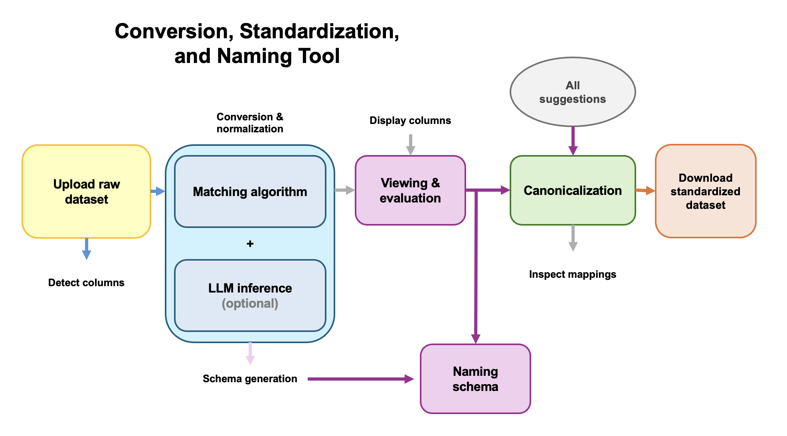

## OpenDV-HCI: A Toolkit for Reproducible Mapping and Reporting of Dependent Variables
**`Standardizing Outcome Measures in Empirical HCI Research Through Schema-Driven Conversion and Open Data Harmonization`**



> This diagram outlines the full standardization and naming pipeline — from raw dataset upload and inference to column matching, canonicalization, and final export. It represents the conceptual framework guiding the core logic and schema design of the research inquiry.
---

## Overview
This repository accompanies the MSc research project titled *"Standardizing Reporting of Dependent Variables in HCI Research: A Naming Scheme and Conversion Tool for Open Data"* (Project Code: P09). The project addresses the pressing challenge of methodological fragmentation and inconsistent naming conventions of dependent variables (DVs) across empirical Human-Computer Interaction (HCI) research.  

Drawing on systematic evidence from [CHI](https://chi2025.acm.org/), [CHI PLAY](https://chiplay.acm.org/2025/), [AutoUI](https://www.auto-ui.org/25/), and other top-tier venues, the project proposes both a **flexible naming scheme** and a **conversion tool** to improve transparency, interoperability, and comparability across open HCI datasets.  

---

## Motivation & Problem Statement
While the HCI community has increasingly embraced open science practices, critical gaps remain in the standardization of outcome variable reporting. Studies frequently use inconsistent labels for conceptually similar constructs (e.g., `taskTime`, `completion_time`, `time_to_complete_task`), hindering:

- Cross-study synthesis and meta-analysis  
- Dataset reuse and integration  
- Empirical reproducibility  
- Compliance with [FAIR data principles](https://www.go-fair.org/fair-principles/)

Despite ongoing advocacy for open methods (Koelle et al., 2024; Goodman et al., 2022), raw data sharing and construct standardization remain underdeveloped in practice. This tool directly addresses those limitations by offering a practical, evidence-driven solution.

---

## Research Objectives
1. Conduct a structured literature review to assess DV reporting inconsistencies and transparency practices in empirical HCI.
2. Develop a DV naming scheme grounded in open science principles and informed by best practices across HCI, psychology, and reproducibility science.
3. Implement a Python-based conversion tool to map inconsistent DV labels to standardized terms.
4. Validate the tool using open datasets from leading conferences and repositories (e.g., [ROADS-CHI25](https://doi.org/10.1145/3640792.3675730)).
5. Advance interoperability and responsible research practices in line with SDG 12 (Responsible Consumption and Production).


## Capabilities

- Schema-driven conversion of raw DV columns into standardized formats
- Built-in sensor-stream canonicalization for common telemetry channels (eye-tracking, Arduino/device feeds)
- Built-in object-detection canonicalization for YOLO-style bounding-box exports
- Built-in metadata/process canonicalization for fields such as `Timestamp`, `Phase`, `Run`, and OSF/VR telemetry indices
- Per-dataset type classification (`results_table`, `questionnaire`, `sensor_stream`, `object_detection`, `process_log`) so the runner applies the right schema family instead of one global alias table
- YAML-based mapping logic for extensibility and transparency
- Run-level reporting for unknown aliases, blocked aliases, and mapping provenance
- Optional LLM-based inference for unresolved DV aliases after explicit mappings have already been checked
- Reproducible prototyping via Jupyter notebooks
- Optional lightweight UI layer for upload-to-export interaction
- Interactive Streamlit UI for single-file standardization and catalog-driven overlap/meta-analysis exploration
- Cross-study synthesis examples in Python and R for standardized multi-dataset analysis (`docs/multi_study_analysis_guide.md`)


---

## Easy Start (for total beginners)

If this is your first time using the project, follow these exact steps.

### 1) Install dependencies

```bash
python -m venv .venv
source .venv/bin/activate
python -m pip install --upgrade pip
pip install -r requirements-core.txt
```

Optional extras:
- `pip install -r requirements-core.txt -r requirements-llm.txt` for local LLM deduction
- `pip install -r requirements-core.txt -r requirements-ui.txt` for the Streamlit UI
- `pip install -r requirements.txt` for the full environment

### 2) Put your dataset somewhere simple

For example:

- `data/raw/my_study.csv` **or**
- `data/raw/my_study.xlsx`

### 3) (Recommended) Add your own small YAML alias file

This is the most beginner-friendly way to help the tool understand your study-specific column names.

Create a file like `data/raw/my_mapping.yaml`:

```yaml
# canonical DV id: aliases used in your dataset
task_completion_time:
  - taskTime
  - completion_time
  - time_to_finish

user_satisfaction:
  - sus_score
  - subjective_rating
  - ux_satisfaction
```

> Tip: Canonical IDs (left side) should come from the project schema in `schemas/standard_dv_mapping.yaml`; aliases (right side) are the names your dataset currently uses.

### 4) Run standardization

```bash
python scripts/convert_dv.py \
  --input data/raw/my_study.csv \
  --schema data/raw/my_mapping.yaml \
  --output data/processed/my_study-standardized.csv
```

What this does:
- applies your YAML aliases,
- keeps canonical OpenDV names from the standard schema as the default authority,
- writes a standardized output file.

### 5) Optional: also generate metadata + suggestions

```bash
python scripts/convert_dv.py \
  --input data/raw/my_study.csv \
  --schema data/raw/my_mapping.yaml \
  --output data/processed/my_study-standardized.csv \
  --with-metadata
```

This creates sidecar files to help you iterate:
- `*_metadata.json` (measurement metadata + review flags)
- `*_schema_suggestions.yaml` (unknown aliases you may want to add to your mapping)

### 6) How the local LLM is used

LLM-assisted alias deduction is integrated in **batch mode** (`scripts/run_batch_standardization.py`), but it is now a fallback rather than the first step.

Per dataset, the runner does this in order:
- classifies the dataset type,
- checks for an explicit repository mapping YAML (requested `mapping_path` first, then the nearest matching YAML),
- applies the relevant built-in schema family (`dv`, `sensor`, `detection`, `metadata`),
- only then asks the local LLM about remaining eligible DV-style aliases.

The LLM is not used for blocked admin fields such as `UserID` or `ConditionID`, and it is also skipped for metadata/process columns and non-DV dataset types such as object-detection files.

Use the provided manifest example as a template:

```bash
python scripts/run_batch_standardization.py \
  --manifest sources_manifest_example.yaml \
  --output-dir data/processed/batch_runs/latest \
  --snapshot-manifest
```

Or create your own **beginner local batch manifest** (example: `data/raw/my_sources_manifest.yaml`):

```yaml
sources:
  - source_id: my_local_study_folder
    source_type: local_path
    location: data/raw/my_batch_folder
    include_globs:
      - "**/*.csv"
      - "**/*.xlsx"
      - "**/*.xls"
      - "**/*.tsv"
    # Optional: skip files you do not want standardized
    exclude_globs:
      - "**/pilot/**"
```

Run it like this:

```bash
python scripts/run_batch_standardization.py \
  --manifest data/raw/my_sources_manifest.yaml \
  --output-dir data/processed/batch_runs/my_first_batch \
  --snapshot-manifest
```

You should then see:
- `data/processed/batch_runs/my_first_batch/meta_view.csv`
- `data/processed/batch_runs/my_first_batch/meta_view.json`
- `data/processed/batch_runs/my_first_batch/run_summary.json`
- `data/processed/batch_runs/my_first_batch/standardized/<source_id>/...`

To improve local LLM inference quality in practice:
- include a clear `README` in your source folder/repo (the tool reads it as context),
- keep meaningful column names,
- optionally include PDFs/manuscripts in the source root (or one level deep) for richer context extraction,
- optionally add `publication_doi`, `publication_pdf_url`, or `llm_context` to a manifest source entry when the paper metadata lives outside the dataset repository.

### Catalog-driven URL workflow

If you already have a CSV/Excel sheet listing dataset URLs or local study folders, you can now run the full workflow from that table:
- deduplicate the URL/path column into unique sources,
- download or load each source,
- standardize the datasets,
- run cross-study meta-analysis,
- export DV overlap artifacts such as a presence matrix and pairwise overlap table.

Example:

```bash
python scripts/run_catalog_meta_analysis.py \
  --catalog data/raw/study_catalog_example.csv \
  --url-column dataset_url \
  --source-id-column study_name \
  --source-type-column source_type \
  --context-columns domain,task \
  --output-dir data/processed/catalog_meta_analysis
```

The repository now includes a starter catalog at `data/raw/study_catalog_example.csv` with GitHub, OSF, scoped GitHub tree, and 4TU examples.

Outputs include:
- `generated_sources_manifest.yaml`
- `catalog_source_summary.csv`
- batch standardization artifacts under `standardized/`
- `meta_view.csv` (per-(source_id, canonical_dv) mapping provenance used by meta-analysis)
- analysis files under `analysis/`, including `meta_analysis_summary.csv`, `study_vs_pool_standardized_deviation.csv`, `dv_overlap_matrix.csv`, `dv_presence_matrix.csv`, and `dv_overlap_details.csv`. When any LLM-deduced mappings are present, sensitivity copies are also written as `*_llm_excluded.csv`.

If you want deterministic behavior (no model downloads/inference), provide a repository mapping YAML in the source so the pipeline uses explicit aliases instead.


---

## Tool Description
The core functionality is a **conversion pipeline** for standardizing column names in `.csv` files using a YAML-based DV mapping schema. The tool allows researchers to rapidly harmonize datasets, reducing manual effort and promoting reproducibility.

```bash
python scripts/convert_dv.py \
  --input data/raw/sample.csv \
  --output data/processed/standardized.csv
```

Example schema (`schemas/standard_dv_mapping.yaml`):

```yaml
task_completion_time:
  - taskTime
  - completionTime
  - time_to_complete_task

user_satisfaction:
  - SUS
  - satisfaction_score
  - subjective_rating
```
> For practical workflows and applied examples, refer to [`docs/usage_workflows.md`](docs/usage_workflows.md).

---

## Batch standardization (manifest-driven)

You can now process multiple data sources (local folders, GitHub repositories or scoped tree URLs, OSF projects, and supported web dataset landing pages such as 4TU) with a single manifest and produce a consolidated meta-view.
The included `sources_manifest_example.yaml` is preconfigured for:
- `https://github.com/M-Colley/roads-chi25-data`
- `https://github.com/M-Colley/ehmi-optimization-chi25-data`

### Process overview

1. The runner validates the manifest and iterates through each source with a `tqdm` progress tracker.
2. For each source, supported datasets (`.csv`, `.tsv`, `.xls`, `.xlsx`, `.pkl`, `.pickle`) are discovered and processed with a per-dataset progress tracker.
3. Each dataset is classified into `results_table`, `questionnaire`, `sensor_stream`, `object_detection`, or `process_log`.
4. If a source/repository includes a mapping YAML, the runner first uses the requested `mapping_path` or the nearest matching mapping file for that dataset.
5. Built-in schema families are then applied as appropriate:
   - `schemas/standard_dv_mapping.yaml`
   - `schemas/standard_sensor_mapping.yaml`
   - `schemas/standard_detection_mapping.yaml`
   - `schemas/standard_metadata_mapping.yaml`
6. Local LLM deduction is only used for still-unmapped DV-style aliases in `results_table` and `questionnaire` datasets.
7. Outputs include standardized files, quality sidecars, an aggregated meta-view, `unknown_alias_summary.json`, `mapping_debug_summary.json`, and source-level availability statuses when a catalog URL is not publicly accessible.

```bash
python scripts/run_batch_standardization.py \
  --manifest sources_manifest_example.yaml \
  --output-dir data/processed/batch_runs/latest \
  --snapshot-manifest
```


### OSF sources

The batch runner supports public OSF projects directly via `source_type: osf_project`.
This is useful for datasets that do not provide a repository-local mapping YAML (for example `https://osf.io/cwd6h/overview`).
OSF sources can include raw tabular files directly, or archives such as `.zip` files containing tabular data in nested subfolders. The runner extracts supported archives recursively and then classifies each discovered dataset before mapping.

For OSF sources, local LLM alias deduction is enabled by default unless you pass `--disable-llm-deduction`, but the same fallback rule still applies: mapping YAML first, built-in schemas second, LLM last.

```yaml
sources:
  - source_id: osf_cwd6h
    source_type: osf_project
    location: https://osf.io/cwd6h/overview
    include_globs: ["**/*.csv", "**/*.tsv", "**/*.xlsx", "**/*.xls"]
    use_llm_deduction: true
    llm_models:
      - Qwen/Qwen3.5-4B
      - microsoft/Phi-4-mini-instruct
      - meta-llama/Llama-3.2-3B-Instruct
```

Run it with caching:

```bash
python scripts/run_batch_standardization.py \
  --manifest sources_manifest_osf_example.yaml \
  --output-dir data/processed/batch_runs/osf_cwd6h \
  --cache-dir data/processed/batch_runs/.cache/sources
```

Deterministic mode (no LLM deduction):

```bash
python scripts/run_batch_standardization.py \
  --manifest sources_manifest_osf_example.yaml \
  --output-dir data/processed/batch_runs/osf_cwd6h_deterministic \
  --disable-llm-deduction
```
Outputs include:
- `meta_view.csv` and `meta_view.json` (cross-source harmonized summary backbone)
- per-source standardized files under `standardized/<source_id>/`
- per-dataset quality sidecars (`*-quality.json`)
- run-level unknown-alias aggregation (`unknown_alias_summary.json`)
- run-level condensed mapping debug summary (`mapping_debug_summary.json`)
- run-level provenance/status log (`run_summary.json`)


---
## Methodology
This project followed a structured literature review methodology. Key steps included:

* Review of >100 papers across CHI (2015-2025), CHI PLAY, AutoUI, and IMWUT, etc. — using PRISMA principles.
* Thematic coding of DV terminology, transparency practices, and naming patterns.
* Development of schema based on recurring inconsistencies in the literature (cf. Aeschbach et al., 2021; Putze et al., 2022).
* Evaluation through a pilot case study using the ROADS dataset (Colley et al., 2024).

> The literature review underpinning this tool was conducted using **Sysrev** ([https://sysrev.com](https://sysrev.com)), a collaborative web-based platform designed for systematic evidence synthesis. Sysrev was selected for its ability to support structured review workflows, including multi-level screening, custom tag definitions, and collaborative annotation. A bespoke review protocol was implemented to identify empirical HCI papers reporting dependent variables, with a focus on CHI, CHI PLAY, AutoUI, and related venues between 2017 and 2024. Custom tagging schemes were developed to encode variable names, study domains, and transparency indicators. This approach enabled rigorous extraction and cross-referencing of DV naming inconsistencies, which directly informed the construction of the canonical naming schema embedded in this tool. The use of Sysrev also ensured traceability of decisions, reproducibility of screening logic, and exportability of encoded metadata into structured formats for further analysis.

---

## Future Work
* Extend the mapping schema to cover qualitative and mixed-method dependent variables, accounting for construct diversity in mixed designs.
* Integrate fuzzy matching capabilities (e.g., via `rapidfuzz`) to enhance robustness against minor lexical variations and human-annotated inconsistencies.
* Build a lightweight [Streamlit](https://streamlit.io) user interface to enable upload-based DV harmonization for non-technical users and HCI practitioners.
* Investigate interoperability with semantic frameworks and metadata standards (e.g., CEDAR, BioPortal) to facilitate alignment with existing ontology-driven research infrastructures.
* Explore the integration of large language models (LLMs) for context-aware variable suggestion, auto-tagging, and disambiguation. This would allow the tool to provide intelligent recommendations for ambiguous or undocumented variable names based on surrounding metadata, potentially accelerating schema expansion and dataset onboarding.
* Incorporate visual analytics to compare pre- and post-standardization states, highlight variable overlaps, and provide interpretable mappings — useful for validation, stakeholder engagement, and pedagogical use.
* Pilot the tool across a broader range of HCI datasets and venues, and refine it into a reusable, community-adoptable research artifact supporting long-term reproducibility and responsible data practices.
---

## References

*The following represent a selected subset of key academic references that informed the design rationale, methodological approach, and conceptual framing of this project. While not exhaustive, these citations reflect foundational contributions to discussions on reproducibility, open science, and metadata standardization in empirical HCI research:*

* **Ebel, P., Bazilinskyy, P., Colley, M., Goodridge, C. M., Hock, P., Janssen, C. P., Sandhaus, H., Srinivasan, A. R., & Wintersberger, P. (2024).** *Changing Lanes Toward Open Science: Openness and Transparency in Automotive User Research*. In *Proceedings of the 16th International Conference on Automotive User Interfaces and Interactive Vehicular Applications (AutomotiveUI ’24)*. ACM. [https://doi.org/10.1145/3640792.3675730](https://doi.org/10.1145/3640792.3675730)

* **Wilkinson, M. D., Dumontier, M., Aalbersberg, I. J., et al. (2016).** The FAIR Guiding Principles for scientific data management and stewardship. *Scientific Data*, 3, 160018. [https://doi.org/10.1038/sdata.2016.18](https://doi.org/10.1038/sdata.2016.18)

---

## Citation
If you use this repository or the accompanying tool, please cite:


#### BibTeX


## Contact Details


## Repository Structure & Rationale
This repository functions as a testbed to evaluate the viability of a canonical naming scheme for dependent variables (DVs) in HCI research and to empirically ground the hypothesis that harmonizing DV nomenclature can significantly enhance dataset interoperability, reuse, and reproducibility. Each folder and script within the repository was carefully aligned with dissertation components to ensure traceability across research stages. The `schemas/` directory houses the naming scheme that operationalizes the standardization logic. The `scripts/` folder contains the conversion tool’s core implementation, demonstrating how real datasets can be mapped using this schema. The notebooks/ directory supports schema ideation (schema_builder.ipynb), validation testing (prototype_notebook.ipynb), visual exploration (visual_validation.ipynb), and forward-looking LLM prototyping (llm_inference_prototype.ipynb). Raw input data and standardized outputs are stored respectively in `data/raw/` and `data/processed/`, thereby offering before/after evidence for tool performance and transformation fidelity. Additional design rationale, transparency strategies, and schema expansion plans are documented in `docs/`, reinforcing the project’s alignment with open science principles. Altogether, the repository serves not only as a demonstration artifact but also as an empirical anchor for validating the dissertation’s core research claims.

```bash
dv-standardization-tool/
├── data/
│   ├── raw/                      # Original datasets + starter catalog
│   │   └── study_catalog_example.csv
│   └── processed/                # Standardized outputs (gitignored)
│
├── schemas/
│   ├── standard_dv_mapping.yaml         # Canonical DV naming scheme
│   ├── standard_sensor_mapping.yaml     # Sensor/telemetry canonicalization
│   ├── standard_detection_mapping.yaml  # YOLO-style detection fields
│   ├── standard_metadata_mapping.yaml   # Metadata / process columns
│   ├── schema_meta.yaml                 # Schema metadata (versioning, authorship)
│   ├── schema_validation_rules.yaml     # Optional constraint rules
│   ├── example_alias_submissions.yaml   # Sample community submissions
│   └── schema_changelog.yaml            # Manual schema evolution tracking
│
├── scripts/
│   ├── convert_dv.py                        # Single-file standardization
│   ├── run_batch_standardization.py         # Manifest-driven batch runner
│   ├── run_catalog_meta_analysis.py         # Catalog → batch → meta-analysis orchestrator
│   ├── schema_utils.py                      # Flattening, validation, and schema helpers
│   ├── visual_helpers.py                    # Comparison visualizations
│   ├── validate_schema.py                   # Schema sanity check
│   └── llm_utils.py                         # Optional LLM inference logic
│
├── analyses/
│   ├── multi_study_analysis.py              # Cross-study overlap & meta-analysis
│   └── run_latest_multi_study_analysis.sh   # Convenience runner against latest batch output
│
├── notebooks/
│   ├── prototype_notebook.ipynb             # Main schema validation/testing
│   ├── schema_builder.ipynb                 # Manual YAML construction notebook
│   ├── visual_validation.ipynb              # Schema alignment visualization
│   └── llm_inference_prototype.ipynb        # Optional LLM-based prototype
│
├── ui/
│   ├── app.py                   # Streamlit app entry point
│   ├── uploader.py              # Upload logic
│   ├── column_preview.py        # Column-level feedback
│   ├── download_button.py       # Download-ready output
│   ├── assets/
│   │   └── style.css            # Minimal styling
│   └── components/              # Optional modular UI elements
│
├── tests/                       # Pytest suite covering pipeline + analyses
│
├── .github/
│   └── ISSUE_TEMPLATE/
│       └── contribution-suggestion.md
│   └── PULL_REQUEST_TEMPLATE.md
│
├── docs/
│   ├── overview.md
│   ├── architecture.md
│   ├── usage_workflows.md
│   ├── multi_study_analysis_guide.md
│   ├── schema_design.md
│   ├── dataset_guidelines.md
│   ├── future_plans.md
│   ├── directory_map.md
│   ├── troubleshooting_index.md
│   └── changelog.md
│
├── troubleshooting/
│   ├── known_issues.md
│   ├── schema_mismatches.md
│   ├── notebook_dependency_notes.md
│   ├── llm_prompt_failures.md
│   ├── trace_convert_dv.txt
│   ├── notebook_kernel_error.txt
│   └── broken_schema_preview_example.png
│
├── sources_manifest_example.yaml   # Example batch manifest
├── LICENSE
├── .gitignore
├── README.md
├── requirements-core.txt
├── requirements-llm.txt
├── requirements-ui.txt
└── requirements.txt
```
